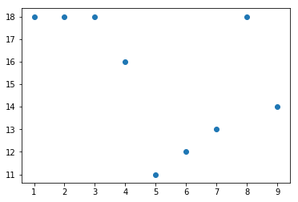

# Outline
* [What is a README?](#What-is-a-README?)
* [List Example](#List)
* [Subheading Example](#Subheading)
* [Python Logo](https://upload.wikimedia.org/wikipedia/commons/thumb/c/c3/Python-logo-notext.svg/1024px-Python-logo-notext.svg.png)
* [Link to student stuff](./student.ipynb#Stuff)

# What is a README?
* .md means 'markdown' and it's a filetype that indicates markdown formatting
* this is similar to a .html that indicates html markup formatting
* The readme is just a markdown file that github will find because it's called 'README.md'
* A README.md acts as the landing page of a repo

# List
listy explanation
* item 1
* item 2
* item 3
- item 4
    * subitem a
    * subitem b
        * another item


## Subheading
This is a subheading example

# Let's add a local image


# To convert a notebook to a markdown file
* file.ipynb -> file.md


do this in terminal 


`jupyter nbconvert --to markdown <file>.ipynb`

<!---
```python
import numpy as np 
import matplotlib.pyplot as plt
```


```python
x = np.arange(1, 10)
y = np.random.randint(10, 20, 9)
```


```python
plt.scatter(x, y)
plt.show()
```
--->




```python

```
